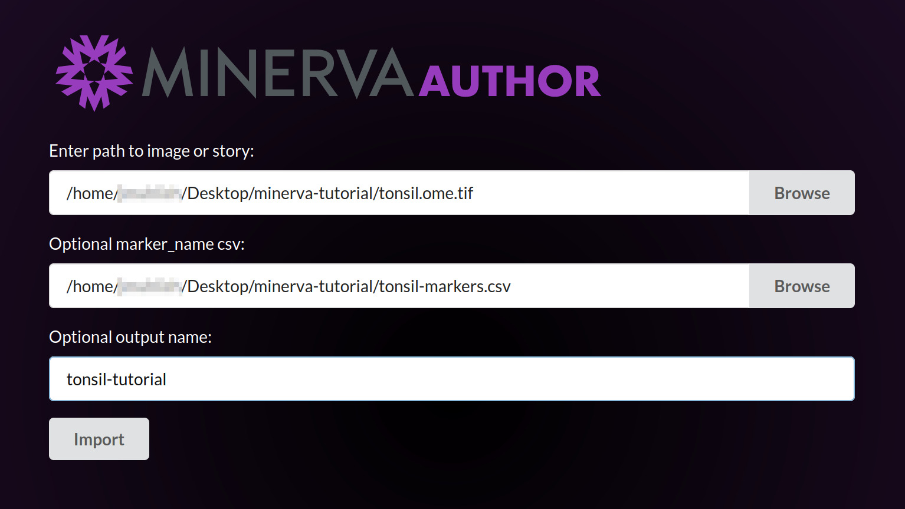

## **Automated** Stories are for quick or large-scale data sharing
* All decisions about image presentation are made _automatically_ by the Minerva Author software.
* Automated stories don't require any manual work or decisions by the author.
* While the output might not be perfect, it's at least very quick to produce.

## Launch Minerva Author
Open your Downloads folder and navigate to the `minerva_author_windows` or `minerva_author_macos`
folder we unzipped during Setup. Open this folder and locate the file named `minerva_author` or
`minerva_author.exe`.

#### Windows users
You may need to navigate one folder level deeper to find the `minerva_author` file. Once you find
it, double-click the file to launch the program. If you see a security popup, click "More info" and
then "Run Anyway".

#### MacOS users
Hold the <kbd>Control</kbd> key and click the `minerva_author` file. Then click "Open" in the menu
that appears. If you see a security popup, click "Open".

### Waiting for the application to launch

A black console window will now open. This is the actual Minerva Author application, but we will
interact with it through a web browser. The application will take about one minute to fully launch,
at which point your browser should automatically open a new tab displaying the Minerva Author
interface. If an error mentioning web browsers appears in the console window, manually navigate to
`http://127.0.0.1:2020/` in your browser. This is what the new browser tab will look like:
{:style="max-width: 800px;" }

> ## This part will take a while
> Tell a joke or do a little soft-shoe to pass the time. Acknowledge that this is frustrating but
> assure the learners that the software team is working to eliminate this delay.
{: .callout}

## Story creation begins with selecting an OME-TIFF image
Under "Enter path to image or story", click Browse.
{:style="max-width: 800px;" }

Navigate in the file browser to your Desktop folder, then the minerva-tutorial folder we created
during Setup, then click the Select button next to the `tonsil.ome.tif` file.
{:style="max-width: 800px;" }

The file browser will close and you will see the full path to `tonsil.ome.tif` in the first form
field.
{:style="max-width: 800px;" }

Under "Optional marker_name csv", click Browse. The `minerva-tutorial` folder should still be
selected. Click the Select button next to the `tonsil-markers.csv` file.
{:style="max-width: 800px;" }

The file browser will close and you will see the full path to `tonsil-markers.csv` in the second
form field.
{:style="max-width: 800px;" }

Under "Optional output name", click the form field and type `tonsil-tutorial`. This text will be
used to define the file name for our new story.
{:style="max-width: 800px;" }

## TODO integrate this text

* Minerva Author will adapt your image data for visual presentation using statistical models and
  best-effort heuristics. Usually they work well but sometimes they do fail to produce the results
  you were expecting. We will discuss how to address these failures in the next episode.

**e.g.** [HTA-CRCATLAS-1](https://labsyspharm.github.io/HTA-CRCATLAS-1/minerva/crc03-overview.html)

> ## Automated Stories can also be made as a part of the MCMICRO workflow
> Check out the [MCMICRO webiste](https://mcmicro.org/overview/#visualization) for more information
> on this (FIX ME - do we have documentation on this? The MCMICRO website currently links to Wiki).
> We will not demonstrate this route in today's tutorial.
{: .callout}


