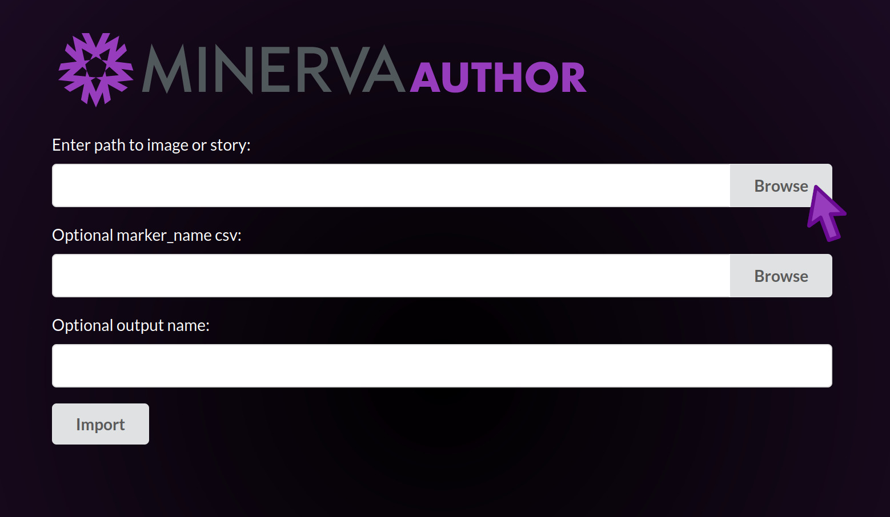

## **Automated** Stories are for quick or large-scale data sharing
* All decisions about image presentation are made _automatically_ by the Minerva Author software.
* Automated stories don't require any manual work or decisions by the author.
* While the output might not be perfect, it's at least very quick to produce.

## Launch Minerva Author
Open your Downloads folder and navigate to the `minerva_author_windows` or `minerva_author_macos`
folder we unzipped during Setup. Open this folder and locate the file named `minerva_author` or
`minerva_author.exe`.

#### Windows users
You may need to navigate one folder level deeper to find the `minerva_author` file. Once you find
it, double-click the file to launch the program. If you see a security popup, click "More info" and
then "Run Anyway".

#### MacOS users
Hold the <kbd>Control</kbd> key and click the `minerva_author` file. Then click "Open" in the menu
that appears. If you see a security popup, click "Open".

### Waiting for the application to launch

A black console window will now open. This is the actual Minerva Author application, but we will
interact with it through a web browser. The application will take about one minute to fully launch,
at which point your browser should automatically open a new tab displaying the Minerva Author
interface. If an error mentioning web browsers appears in the console window, manually navigate to
`http://127.0.0.1:2020/` in your browser. This is what the new browser tab will look like:

{:style="max-width: 800px;" }

> ## This part will take a while
> Acknowledge that this is frustrating but assure the learners that the software team is working to
> eliminate this delay.
{: .callout}

* When you want to quit Minerva Author, you will close this console window.
* If you accidentally close the console window, close your Minerva Author web browser tab and
  re-launch the Minerva Author application by following the instructions above.

## Story creation begins with selecting an OME-TIFF image
Under "Enter path to image or story", click Browse.

{:style="max-width: 800px;" }

The file browser allows you to navigate your folders and files in order to choose an OME-TIFF image
file with which to create your story. We will be selecting the example tonsil image we downloaded
earlier.

* Navigate in the file browser to your Desktop folder, then the minerva-tutorial folder we created
  during Setup.
* Click the Select button next to the `tonsil.ome.tif` file.
* If you navigate into the wrong folder by mistake, click the left arrow button at the top left to
  go back up one folder level.
* The file browser will only allow you to select OME-TIFF files (and previously saved story files,
  which we will cover later).
* You can close the file browser to cancel choosing a file with the X button in the upper right.
* If you click Select on the wrong file, you can click the Browse button to reopen the file browser
  and choose another file.

{:style="max-width: 800px;" }

The file browser will close and you will see the full path to `tonsil.ome.tif` in the first form
field.

{:style="max-width: 800px;" }

Under "Optional marker_name csv", click Browse. The `minerva-tutorial` folder should still be
selected. Click the Select button next to the `tonsil-markers.csv` file.

* For your own images, you will select the matching "markers.csv" file used for mcmicro.
* If your OME-TIFF contains embedded channel names, you may skip selecting a marker csv file.

{:style="max-width: 800px;" }

The file browser will close and you will see the full path to `tonsil-markers.csv` in the second
form field.

{:style="max-width: 800px;" }

Finally, click the Import button. A spinning progress indicator will appear for a few seconds while
Minerva Author loads the image.

* The time to load the image depends on how many channels the image has and how fast your computer
  is.
* The example tonsil image has ten channels and should load in just a few seconds.

{:style="max-width: 800px;" }

## First look at the story editing interface

When the image loading is complete, the view will change to show the story editing interface.

* A dialog window will appear, displaying a summary of your input file and output location settings.
  Click the OK button to dismiss it.
* In the editing interface you can now see, the upper left area contains buttons and other
  interactive elements for editing your story. We will explain each one gradually over the course of
  this tutorial.
* The first two channels of the image are shown in white and red in the background.
* You can freely explore the image. To pan around, click and drag on the image. To zoom in and out,
  put your cursor over the image and pinch or two-finger scroll on a trackpad or scroll with a mouse
  wheel.

{:style="max-width: 800px;" }

> ## Navigating the image
>
> Pan and zoom the image so the germinal center (the large round structure filled with red
> Ki-67-positive cells) is centered and fills up most of your screen.
{: .challenge}

## Channel groups define meaningful sets of image channels

It is difficult to accurately display more than a few image channels at one time using different
colors. Turning individual channels on and off manually would be a lot of work for viewers of a
story, and furthermore viewers may not even know which channels make sense to display together in
the context of your images. To help solve this problem, Minerva lets the story author group related
channels together and assign them distinct colors. Later we will see how these channel groups can
used to enhance the narrative flow of your story, but initially we will focus just on creating and
viewing these groups.

## The Auto Group button groups all channels using simple rules

While Minerva Author has many options for manually configuring channel groups and other channel
settings, our goal for now is to create an Automated story that doesn't need much effort or
decisionmaking. Therefore we will use the Auto Group feature, which groups and colorizes all
channels in your image using a few simple rules.

Click the "Auto Group" button now. A dialog will appear with a summary of the groups to be created,
and a reminder that any existing channel groups in your story will be deleted. Click OK to
continue. In the future, you can use the Cancel button if you ever click Auto Group by accident.

{:style="max-width: 800px;" }

{:style="max-width: 800px;" }

> ## Auto Group results
>
> What do you notice has changed on the screen after running Auto Group?
{: .challenge}

### Channel grouping rules

1. If your image has channels whose names start with "DNA" or "Hoechst" spaced regularly across the
   channel list, Minerva Author will assume your image comes from a cyclic imaging method such as
   CyCIF and create groups based on your imaging cycles. The DNA or Hoechst channels will be used as
   a reference to locate the cycle boundaries.
2. If your channel names do not fit this pattern, channels will be grouped in sets of 3, 4 or 5 --
   whichever group size best fits your total number of channels.

### Channel color assignment rules

Regardless of which grouping rule was used, colors will be assigned to the channels in each group
using a fixed color list: 1-white, 2-red, 3-green, 4-blue, and 5-magenta. Groups with fewer than
five channels will use only the lower-numbered colors in the list.

### Group naming rules

The automatically created groups will be named "Group 1", "Group 2", and so on.

## Previewing your story

Up until now, we have been looking at the story _authoring_ interface. Once your story is
_published_ on the web, the _viewing_ interface looks somewhat different. To see exactly what your
published story will look like, click the Preview button. This will open your story in preview mode
in a new tab. Explore the story in preview mode and close that browser tab when you are done.

{:style="max-width: 800px;" }

## Save your story

Now that we are done with all the steps for creating an Automated story, we will save it to a file.

Click the "Save As" button. A dialog will appear, prompting you for a folder (directory) and file
name for saving. Click the Browse button and navigate to your Desktop folder, then click the Select
button next to the minerva-tutorial folder. If you accidentally navigate into the minerva-tutorial
folder instead of clicking Select, click the left arrow button in the top left to go back up one
level.

Click in the "output name" field, delete the existing text and type `tonsil-tutorial`. This name
will be used along with the extension `.story.json` to create your story save file. In this case the
full file name will be `tonsil-tutorial.story.json`.

### Story save files only point to original image data

story.json files are extremely tiny, usually just a few kilobytes. They do not store a copy of your
image data, but rather a pointer to where the original image file lives. If that original image file
is moved or you open the story file on a different computer, Minerva Author will prompt you to find
the new location of the image file.

## Close and reload your story

To demonstrate that your story was successfully saved, and also how to open an existing story, we
will close this story and open it back up from the save file.

First, click on the "Close" button in the upper right corner of the screen. If you see a dialog pop
up warning you about unsaved changes, you can click "OK" since we know we just saved our story. If
you see this later on your own, consider whether you have made any important changes since saving
and click "OK" or "Cancel" accordingly.

Now, click the first Browse button and navigate to your Desktop minerva-tutorial folder. You will
notice that there are now two files with a Select button indicating they are available to open:
`tonsil.ome.tif` which we opened to initially create our story, and also
`tonsil-tutorial.story.json` which is the story file we just saved. Click Select next to the
story.json file, then click the Import button. Everything should appear as it did when we clicked
"Save As" earlier.

> ## Auto-saving
>
> Even before you clicked "Save As", Minerva Story was continually auto-saving your work so you can
> recover if the program crashes. The auto-save files can be found in the folder next to the
> minerva_author program file. The auto-saves are regular story.json files that can be opened like
> any other story file.
>
> Minerva Author also auto-saves after you click "Save As". If the program crashes during editing,
> then upon reopening your story file you will be prompted whether to recover your story using
> the auto-save data.
{: .callout}

## Publishing your story

The last step is to create the file package that will be uploaded to your web hosting service for
viewing by your audience. Click the Publish button, and a dialog will appear prompting you for a
folder location and sub-folder name. We will use the default values, which will place the published
file package next to your story.json file using a sub-folder with the same base name. In this case
the sub-folder will be named `tonsil-tutorial`. Now click the Publish button in the dialog, which
will close the dialog and begin the publishing process. While the process is running the Publish
button will display a spinning animation, and a progress bar with percent completion will appear
below it. Once the progress bar reaches 100%, the file package is complete.

> ## Getting your file package on the web
>
> The process of actually putting the published file package on the web is beyond the scope of this
> tutorial. Consult the IT staff at your institution for guidance.
{: .callout}

## TODO integrate this text

* Minerva Author will adapt your image data for visual presentation using statistical models and
  best-effort heuristics. Usually they work well but sometimes they do fail to produce the results
  you were expecting. We will discuss how to address these failures in the next episode.

**e.g.** [HTA-CRCATLAS-1](https://labsyspharm.github.io/HTA-CRCATLAS-1/minerva/crc03-overview.html)

> ## Automated Stories can also be made as a part of the MCMICRO workflow
> Check out the [MCMICRO webiste](https://mcmicro.org/overview/#visualization) for more information
> on this (FIX ME - do we have documentation on this? The MCMICRO website currently links to Wiki).
> We will not demonstrate this route in today's tutorial.
{: .callout}


