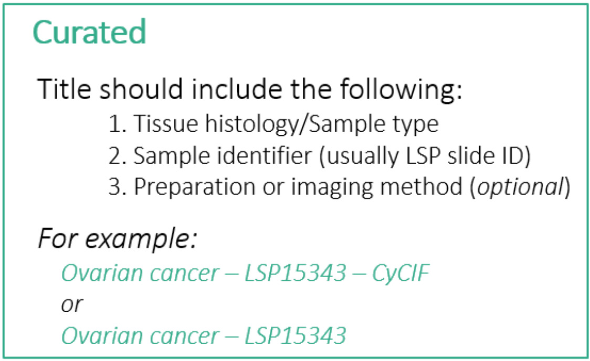
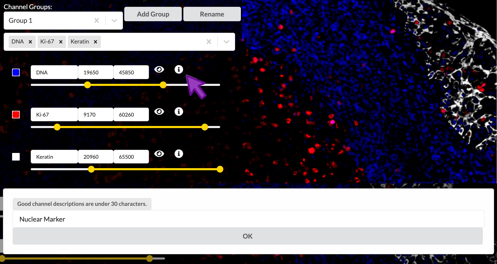
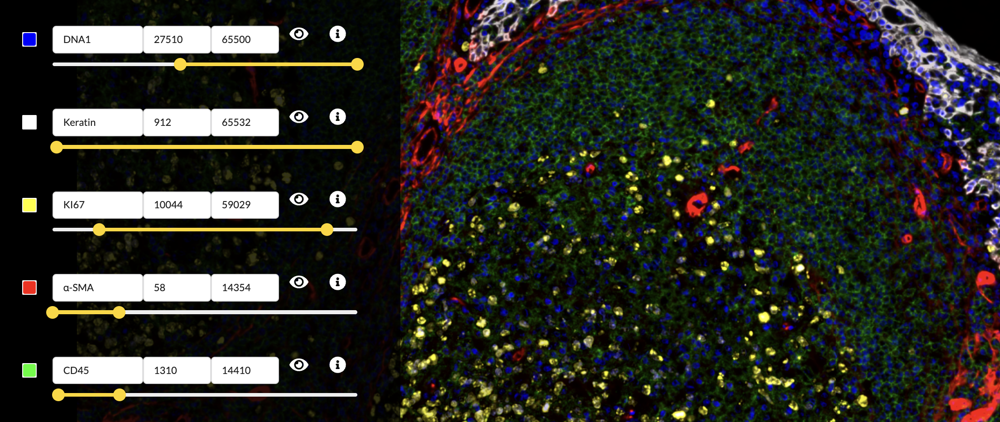

## **Curated** Stories are reviewed for quality and context

* Curated stories involve human review for accuracy, quality and context.
* A curated story specifically includes [MITI](https://www.tissue-atlas.org/curriculum#miti-minimum-information-about-tissue-imaging) metadata and fine-tuned rendering settings.
* The stories ensure that the data is represented ideally and understandable to others.

## The authoring interface has three main modes

Minerva Author has three main modes for editing a story. You can switch between these modes by
clicking the gray buttons just below the Save/Publish/Preview buttons. We will follow a particular
sequence through the different modes during this tutorial, but on your own you are free to switch
back and forth at any time.

1. **Sample Info** lets you adjust settings and enter information that relate to your image as a
   whole and manage the initial image view shown when viewers first open your story.
2. **Edit Groups** is where you manage Channel Groups, which we briefly touched on in the previous
   episode.
3. **Edit Story** allows creating narrative guide elements.

For Curated stories we will only work with the first two, Sample Info and Edit Groups.

{:style="max-width: 800px;"}

## Sample Info

Click the "Sample Info" button to switch to Sample Info editing mode.

{:style="max-width: 800px;"}

## Enter sample name

Although the first item at the top of the edit screen is the Channel Groups selector, we will skip
over this for now and return to it later. The first thing we will edit is the Sample Name field,
which will serve as the title of the story. The LSP guidelines for a Curated story title are as
follows:

* Less than 75 characters (including spaces)
* Include the following pieces of information:
  1. Tissue histology or sample type
  2. Sample identifier (usually LSP Slide ID)
  3. Preparation or imaging method (optional)

{:style="max-width: 800px;"}

For this story we will follow these guidelines and use the title "Tonsil - TONSIL-1 - CyCIF". You
can find this title text in the file content-03.txt that we downloaded during setup. Open that text
file now and leave it open for the rest of this episode as we will be copying other pieces of text
from it. The title text is at the top under the heading "Title".

## Write a plain-language summary to provide context

Next we will proceed down the screen to the Sample Description field. Here you will begin by writing
a short summary of the sample in plain text to provide context to viewers of the story. This summary
should include a few key pieces of metadata such as the sample origin, basic demographics, and
patient diagnosis. You can find a pre-written summary in content-03.txt under the heading "Sample
summary". Copy the text there and paste it into Minerva Author in the Sample Description field.

The Sample Description field allows you to apply rich text formatting using a special syntax called
Markdown. You can look up a Markdown guide online to find out what it can do, and we've provided a
link to such a guide in the reference material for this lesson. The provided summary text does not
use any Markdown syntax, but in the next step we will see some basic examples.

## Paste and edit the MITI metadata template

Below the summary text you will now append relevant metadata fields based on the MITI (Minimum
Information about Tissue Imaging) standard. LSP has a comprehensive metadata template hosted on
SharePoint, but for today we will use a shortened version. The template provides an easy-to-edit
Markdown-formatted list of the metadata fields that you should strongly consider filling out where
relevant. It provides a common baseline that all Curated stories at LSP should meet, but you can
always add more fields to your story if you like.

Switch to content-03.txt and copy the text under the heading "Metadata template". Paste the text
below the summary text we added in the previous step. You will notice some unusual punctuation
characters like pound signs and asterisks -- these are part of the special Markdown syntax to create
headings, bold text, and the like, but you will not have to touch any of that for the template. You
will fill in your values at the end of each line or edit the placeholder text as needed. It is
important to enter your text immediately next to the final asterisk, leaving the two blank spaces at
the end of each line in place (these spaces are required for the template formatting to work
properly).

{:style="max-width: 800px;"}

Lastly, using the field values provided below the metadata template section in content-03.txt, fill
in the corresponding lines in the metadata template (Site of Resection or Biopsy, Microscope,
Objective, and Attribution). I will fill out my template as a reference to follow. For this
tutorial, you can choose to either delete all the irrelevant or unknown fields or play around with
filling them out however you wish. As the sample was fully deidentified as part of the sample
collection protocol, we simply don't have much information about the patient.

Click the Preview button to view your Sample Description content as it will look once published and
make sure the content and formatting looks the way you want it to. Close the preview tab when you're
ready to continue.

## Verify or enter pixel size to create a scale bar

Farther down the screen you will see a field labeled "Pixel size, in microns". A value of
approximately 0.325 should have been automatically loaded from the OME-TIFF metadata in our example
image. For your own stories, always check that this value is correct. If it is blank, look up the
pixel size for your image (also called nominal image resolution) and enter it here. The value must
always be specified in microns. The value in this field will be used to give your story a scale bar,
which is a crucial component of image interpretability.

## Editing channel groups and channel settings

Next we will spend some time learning how to edit channel groups and channel settings. Click the
"Edit Groups" button to switch to that mode.

As we have seen, the way the image channels are grouped by the Automated story creation process does
not necessarily highlight useful aspects of tissue biology that you might wish to show to your story
viewers. The first thing we will do to address that is decide on more useful groups and rearrange
our channels accordingly.

## Select and rename a channel group

You can select a channel group to work with from the dropdown menu under "Channel Groups". To change
the name of a channel group, click the "Rename" button, type the new name into the popup, then click
OK. Each channel group must have a unique name within a story.

{:style="max-width: 800px;"}

## Addding and removing a channel group

A new channel group can be added by clicking "Add Group", typing the desired name in to the popup,
and clicking "OK". The currently active channel group can be removed by clicking the "X" just to the
right of its name.

{:style="max-width: 800px;"}

> ## Removing a channel group never deletes the channels that were in it
> Channels themselves can never be deleted from a story. If you delete a channel group, its channels
> always remain available to add to other groups.
{: .callout}

Let's make our first group show the overall tissue architecture of the tonsil tissue, along with a
general-purpose immune cell marker. It looks like Group 1 is already pretty close, containing DNA,
Ki-67, and Keratin, so we will rename Group 1 for this purpose. Then we will create a new group to
highlight different immune cell types, and lastly delete Group 2.

> ## Rename, add and remove channel groups
> 1. Rename the channel group "Group 1" to "Structural components".
> 2. Add a new channel group named "Immune cells".
> 3. Delete channel group "Group 2".
{: .challenge}

## Adding and removing channels from groups

You can add a channel to the active channel group by clicking the down arrow in the channel dropdown
menu (or the empty white space to the left of the arrow) to open the list of channels, followed by
clicking a channel. You can also type to search for a channel by name while the channel list is
open. Remove a channel from the group by clicking the small "X" next to its name. If you ever want
to remove all channels from a group, click the large "X" near the right side of the channel dropdown
menu. Note that a channel may belong to more than one group at the same time -- for example, many
stories of CyCIF images include the first DNA channel in every group as a reference to show where
all cells are located regardless of marker expression.

{:style="max-width: 800px;"}

> ## Removing a channel from a group does not delete the actual channel
> This is another reminder that channels themselves can never be deleted from a story. If you remove a
> channel from a group, it always remains available to add to other groups.
{: .callout}

## Reordering channels within a group

You can drag the gray channel name boxes left and right to change their order. This only changes the
order in which the channels will be presented in the published story's channel legend but can be
useful in some cases.

Now we will refine our two channel groups to contain the correct channels.

> ## Add and remove channels from groups
> 1. Add the following channels to the "Structural components" group:
>   * α-SMA
>   * CD45
> 2. Remove the following channels from the "Structural components" group:
>   * CD3D
>   * CD4
> 3. Drag Keratin left to order it between DNA1 and Ki-67.
> 4. Add the following channels to the "Immune cells" group:
>   * CD20
>   * CD8A
>   * CD4
>   * CD3D
{: .challenge}

> ## Channels may extend beyond your screen 
> When a channel group contains more channels than can be displayed on a single screen,
> you can use your mouse or trackpad to scroll down to view the additional channels.
{: .callout}

## Adjusting per-channel settings

Now we will move our focus down from the channel dropdown menu to the channel settings list where we
can adjust name, color, brightness and contrast, and more.

## Renaming channels

You may rename a channel by clicking on the box containing its name in the channel settings list and
editing the text.

> ## Rename channels
> * Edit the DNA1 channel's name to "DNA".
> * Edit the KI67 channel's name to "Ki-67".
{: .challenge}

## Creating channel descriptions

Short channel names are an efficient shorthand for those who already know the significance of the
referenced proteins or other biomarkers, but they are much less helpful to outsiders from a more
general audience. It is strongly suggested that you write a brief description (up to 30 characters)
of each channel that explains its intended interpretation in the context of the tissue sample and
the overall experiment. You can add these descriptions to the channels in your story by clicking the
encircled "i" button to the right of a channel's entry in the channel settings list. Then enter the
channel's description into the popup and click OK.

{:style="max-width: 800px;"}

> ## Enter channel descriptions
> Set the channel description for all nine active channels as follows. This text is provided at the
> end of content-03.txt if you wish to copy and paste it. Note that you will need to switch between
> the channel groups to get to all the channels.
> * DNA1: Nuclei
> * Keratin: Crypt epithelium
> * Ki-67: Proliferating immune cells
> * aSMA: Blood vessels
> * CD45: Immune cells (general)
> * CD20: B-cells
> * CD8A: Cytotoxic T-cells
> * CD4: T-helper cells
> * CD3D: T-cells (all)
{: .challenge}

## Toggle a channel's visibility

You can show or hide a channel by clicking the "eye" icon to the right of its entry in the channel
settings list. This effect is not reflected in the published story, but it can be useful to
temporarily isolate channels when adjusting color or brightness and contrast settings.

{:style="max-width: 800px;"}

## Brightness and contrast

You can move the endpoints of the yellow intensity range slider to adjust the brightness and
contrast of the corresponding channel in the active channel group. Moving the right handle of slider
will set the upper intensity cutoff value, meaning all pixels brighter than this value will be
displayed at maximum brightness. The left handle controls the lower cutoff, meaning all pixels
dimmer than this value will be displayed as black, in other words not visible. Pixel values in
betweeen the two cutoffs will be mapped linearly to brightness values on the screen display. Any
adjustments will to apply to the channel across all channel groups it is in and any groups it may be
added to in the future.

Notice that these cutoffs are all at different values in each channel, and they did not start at
their extreme values as is often the case in other image display applications. This is part of the
Automated story process and actually happened when you first loaded the image in the previous
episode. Minerva Author uses a statistical model to make a principled guess at what the cutoff
values should be based on the distribution of pixel intensity values in each channel, but it isn't
perfect and it has no idea of what part of the signal intensity scale is actually relevant to your
biology.

Lowering the upper cutoff has the effect of increasing the channel image brightness, so you usually
want to lower it as far as possible. However lowering it too far will wash out the brighest parts of
the image and destroy the texture and finer details of those cells. Raising the lower cutoff has the
effect of hiding background signal and dimmer non-specific binding, raising the apparent
signal-to-noise ratio. However raising it too far will hide important details in the dimmer regions
of the image. Adjusting the intensity cutoff values requires making tradeoffs between a punchy image
and faithfully representing the data.

The intensity range slider provides a direct way to control how each image channel is rendered, yet
has the same effect as adjusting brightness and contrast. The goal is to keep in mind the biological
significance of the image representation while presenting what you want your viewer to see.

{:style="max-width: 800px;"}

> ## Adjust channel intensity cutoffs
> Zoom in to focus on the area between the upper right border of the germinal center and the crypt
> epithelium. The DNA and CD45 channels are brightest in this region. The Automated settings left
> things a bit too saturated here, so adjust the intensity cutoffs to fix the problem.
>
> (Hint: You will probably want to toggle the other channels off to view one channel at a time here)
{: .challenge}

## Color selection

You can select the small square to the left of the channel name to adjust the color applied to that
channel. You can then select a color within the color selection menu. When satisfied with the color
chosen, you can then close the color selection menu by clicking outside of it. Any adjustments will
apply to channel within the scope of the active channel group and within any new channel groups
created thereafter.

{:style="max-width: 800px;"}

Selecting the color of each channel is a subjective process, but there are several considerations it
is important to understand. Fist, the channels in each group are individually colorized and added to
create a linearly composited image. Second, the number of distinct channels that can be visualized
in a composit image is quite limited. This limitation is due to the nature of additive colors, where,
for example, a green channel and a blue channel would be indistinguishable from a yellow channel.
These limitations can be circumvented by considering the spatial overlap of channels.

> ## Select channel colors
> In the "Edit Groups" tab, select the "Structure Components" group
> * Set the DNA1 channel's color to blue.
> * Set the Keratin channel's color to white.
> * Set the Ki67 channel's color to yellow.
> * Set the α-SMA channel's color to red.
> * Set the CD45 channel's color to green.
{: .challenge}

{:style="max-width: 800px;"}

## Save your Story

After all of this work, make sure to click the Save button!


