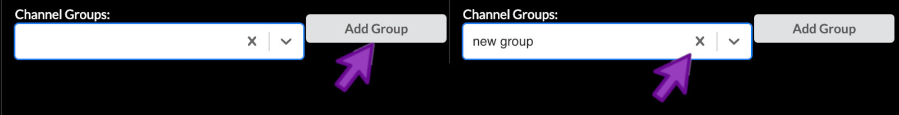

## **Curated** Stories are reviewed for quality and context

* Curated stories involve human review for accuracy, quality and context.
* A curated story specifically includes [MITI](https://www.tissue-atlas.org/curriculum#miti-minimum-information-about-tissue-imaging) metadata and fine-tuned rendering settings.
* The stories ensure that the data is represented ideally and understandable to others.

## The authoring interface has three main modes

Minerva Author has three main modes for editing a story. You can switch between these modes by
clicking the gray buttons just below the Save/Publish/Preview buttons.

1. **Sample Info** lets you adjust settings and enter information that relate to your image as a
   whole and manage the initial image view shown when viewers first open your story.
2. **Edit Groups** is where you manage Channel Groups, which we briefly touched on in the previous
   episode.
3. **Edit Story** allows creating narrative guide elements.

For Curated stories we will only work with the first two, Sample Info and Edit Groups.

{:style="max-width: 800px;"}

## Sample Info

Click the "Sample Info" button to switch to Sample Info editing mode.

{:style="max-width: 800px;"}

## Enter sample name

Although the first item at the top of the edit screen is the Channel Groups selector, we will skip
over this for now and return to it later. The first thing we will edit is the Sample Name field,
which will serve as the title of the story. The LSP guidelines for a Curated story title are as
follows:

* Less than 75 characters (including spaces)
* Include the following pieces of information:
  1. Tissue histology or sample type
  2. Sample identifier (usually LSP Slide ID)
  3. Preparation or imaging method (optional)

{:style="max-width: 800px;"}

For this story we will follow these guidelines and use the title "Tonsil - TONSIL-1 - CyCIF". You
can find this title text in the file content-03.txt that we downloaded during setup. Open that text
file now and leave it open for the rest of this episode as we will be copying other pieces of text
from it. The title text is at the top under the heading "Title".

## Write a plain-language summary to provide context

Next we will proceed down the screen to the Sample Description field. Here you will begin by writing
a short summary of the sample in plain text to provide context to viewers of the story. This summary
should include a few key pieces of metadata such as the sample origin, basic demographics, and
patient diagnosis. You can find a pre-written summary in content-03.txt under the heading "Sample
summary". Copy the text there and paste it into Minerva Author in the Sample Description field.

The Sample Description field allows you to apply rich text formatting using a special syntax called
Markdown. You can look up a Markdown guide online to find out what it can do, and we've provided a
link to such a guide in the reference material for this lesson. The provided summary text does not
use any Markdown syntax, but in the next step we will see some basic examples.

## Paste and edit the MITI metadata template

Below the summary text you will now append relevant metadata fields based on the MITI (Minimum
Information about Tissue Imaging) standard. LSP has a comprehensive metadata template hosted on
SharePoint, but for today we will use a shortened version. The template provides an easy-to-edit
Markdown-formatted list of the metadata fields that you should strongly consider filling out where
relevant. It provides a common baseline that all Curated stories at LSP should meet, but you can
always add more fields to your story if you like.

Switch to content-03.txt and copy the text under the heading "Metadata template". Paste the text
below the summary text we added in the previous step. You will notice some unusual punctuation
characters like pound signs and asterisks -- these are part of the special Markdown syntax to create
headings, bold text, and the like, but you will not have to touch any of that for the template. You
will fill in your values at the end of each line or edit the placeholder text as needed. It is
important to enter your text immediately next to the final asterisk, leaving the two blank spaces at
the end of each line in place (these spaces are required for the template formatting to work
properly).

{:style="max-width: 800px;"}

Lastly, using the field values provided below the metadata template section in content-03.txt, fill
in the corresponding lines in the metadata template (Site of Resection or Biopsy, Microscope,
Objective, and Attribution). I will fill out my template as a reference to follow. For this
tutorial, you can choose to either delete all the irrelevant or unknown fields or play around with
filling them out however you wish. As the sample was fully deidentified as part of the sample
collection protocol, we simply don't have much information about the patient.

Click the Preview button to view your Sample Description content as it will look once published and
make sure the content and formatting looks the way you want it to. Close the preview tab when you're
ready to continue.

## Verify or enter pixel size to create a scale bar

Farther down the screen you will see a field labeled "Pixel size, in microns". A value of
approximately 0.325 should have been automatically loaded from the OME-TIFF metadata in our example
image. For your own stories, always check that this value is correct. If it is blank, look up the
pixel size for your image (also called nominal image resolution) and enter it here. The value must
always be specified in microns. The value in this field will be used to give your story a scale bar,
which is a crucial component of image interpretability.

## Edit Groups

Curated stories include fine-tuned rendering settings, which can be created through the "Edit Groups" tab. This tab is open once an image is loaded into Minerva Author.

### Select and rename a channel group

You can select to edit a given channel group from the dropdown menu under "Channel Groups:". Each channel group must have a unique name. To change the name of a channel group, you can click the "Rename" button. Then, you can enter the new channel group's name into the provided text field.

{:style="max-width: 800px;"}

### Add or remove a channel group

A channel group can be added either by clicking "Add Group", or by typing a new name directly into the "Channel Groups" dropdown menu. The currently active channel group can be removed by clicking the "X" within the right side of the "Channel Groups" dropdown menu.

{:style="max-width: 800px;"}

### Add or remove a channel

You can add a channel to the active channel group by opening the channel dropdown menu and selecting a channel from among the list. Or, you can search for a channel to add by typing into the list of options. Individual channels can be cleared by clicking the "X" to the right of a channel name in the list of options. entire channel group can be cleared by clicking the rightmost "X".

{:style="max-width: 800px;"}

### Describe a channel

You can provide a brief (no more than 30-character) description for a given channel by clicking the encircled "i" to the right of any given channel. Then, you can enter the channel's description into the provided text field. This description will be shown in the Story adjacent to the name of the described channel.

{:style="max-width: 800px;"}

### Toggle a channel

You can show or hide a given channel by clicking the "eye" icon to the right of any given channel. This effect is not reflected in the Story.

{:style="max-width: 800px;"}

### Brightness and contrast

You can move the endpoints of the yellow range slider to adjust the brightness and contrast of the corresponding channel in the active channel group. Moving the right handle of slider from left to right will darken the corresponding channel. Moving the right handle of the slider from right to left will brighten the corresponding channel. Any adjustments will to apply to channel within the scope of the active channel group and within any new channel groups created thereafter.

{:style="max-width: 800px;"}

### Color selection

You can select the small square to the left of the channel name to adjust the color applied to that channel. You can then select a color within the color selection menu. Any adjustments will to apply to channel within the scope of the active channel group and within any new channel groups created thereafter.

{:style="max-width: 800px;"}

## Save your Story

After all of this work, make sure to click the Save button!


