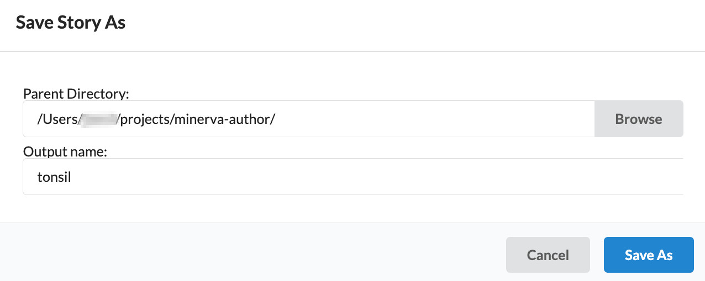

## **Curated** Stories are reviewed for quality and context

* Curated stories involve human review for accuracy, quality and context.
* A curated Story specifically includes [MITI](https://www.tissue-atlas.org/curriculum#miti-minimum-information-about-tissue-imaging) metadata and fine-tuned rendering settings.
* The stories ensure that the data is represented ideally and understandable to others.

## Tabs and their features

Curated Stories require two of the three tabs shown at the top of the Minerva Author interface. Namelny, curated Stories require the "Sample Info" and "Edit Groups" tabs. In the "Sample Info" tab, you can define how the image is initially presented in the Story. In the "Edit Groups" tab, you can define a curated list of "channel groups." Each channel group combines a selection of channels to represent the image in different ways.

{:style="max-width: 800px;"}

## Edit Groups

Curated stories include fine-tuned rendering settings, which can be created through the "Edit Groups" tab. This tab is open once an image is loaded into Minerva Author.

### Select and rename a channel group

You can select to edit a given channel group from the dropdown menu under "Channel Groups:". Each channel group must have a unique name. To change the name of a channel group, you can click the "Rename" button. Then, you can enter the new channel group's name into the provided text field.

{:style="max-width: 800px;"}

### Add or remove a channel group

A channel group can be added either by clicking "Add Group", or by typing a new name directly into the "Channel Groups" dropdown menu. The currently active channel group can be removed by clicking the "X" within the right side of the "Channel Groups" dropdown menu.

{:style="max-width: 800px;"}

### Add or remove a channel

You can add a channel to the active channel group by opening the channel dropdown menu and selecting a channel from among the list. Or, you can search for a channel to add by typing into the list of options. Individual channels can be cleared by clicking the "X" to the right of a channel name in the list of options. entire channel group can be cleared by clicking the rightmost "X".

{:style="max-width: 800px;"}

### Describe a channel

You can provide a brief (no more than 30-character) description for a given channel by clicking the encircled "i" to the right of any given channel. Then, you can enter the channel's description into the provided text field. This description will be shown in the Story adjacent to the name of the described channel.

{:style="max-width: 800px;"}

### Toggle a channel

You can show or hide a given channel by clicking the "eye" icon to the right of any given channel. This effect is not reflected in the Story.

{:style="max-width: 800px;"}

### Brightness and contrast

You can move the endpoints of the yellow range slider to adjust the brightness and contrast of the corresponding channel in the active channel group. Moving the right handle of slider from left to right will darken the corresponding channel. Moving the right handle of the slider from right to left will brighten the corresponding channel. Any adjustments will to apply to channel within the scope of the active channel group and within any new channel groups created thereafter.

{:style="max-width: 800px;"}

### Color selection

You can select the small square to the left of the channel name to adjust the color applied to that channel. You can then select a color within the color selection menu. Any adjustments will to apply to channel within the scope of the active channel group and within any new channel groups created thereafter.

{:style="max-width: 800px;"}

### Add a channel group

## Sample Info

Curated stories include MITI metadata, which can be added through the "Sample Info" tab. From the three available tabs, find and select the "Sample Info" tab:

{:style="max-width: 800px;"}

### Enter MITI Metadata

You can paste MITI Metadata from the provided template into the "Sample Description" field of the "Sample Info" tab. You can also enter the microscope resolution in terms of the pixel size in microns.

{:style="max-width: 800px;"}

### Save your Story

At this point, you may click "Save", or "Save As" to store a configuration file containing the changes you have made. The "Save" button will output the configuration file in the same directory as the Minerva Author executable file. The "Save As" option will enable you to save a configuration file to an arbitrary directory with a new name.

{:style="max-width: 800px;"}

## Example of Curated Story

**e.g.** [Ovarian Cancer with Annotation-LSP15343](https://www.cycif.org/data/gray-stic-1-mini/), [MEL-3D-MIS-2](https://www.cycif.org/data/mel-3d-mis-2/)


