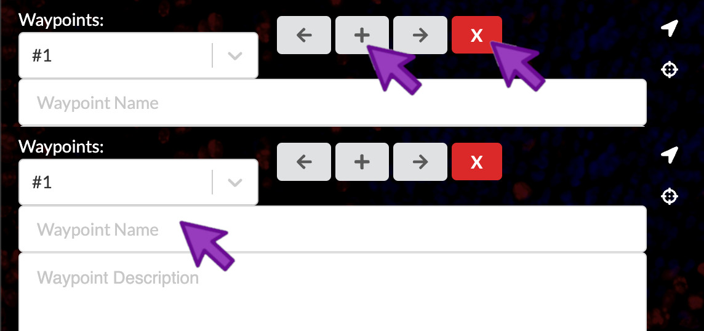
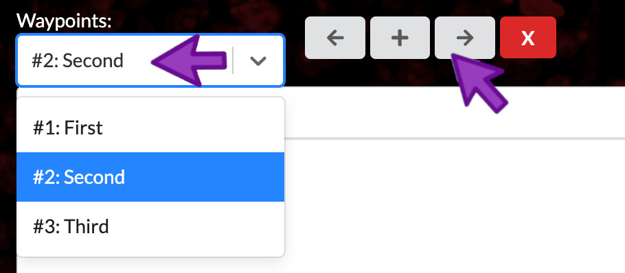
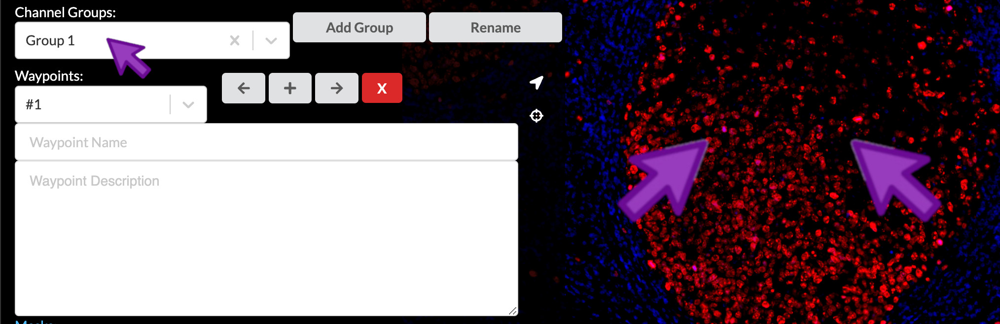
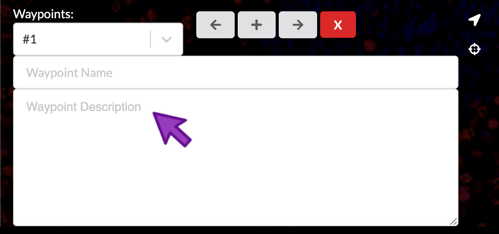
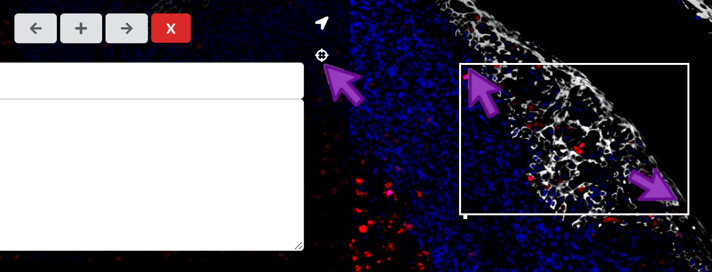
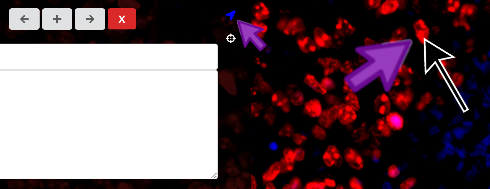
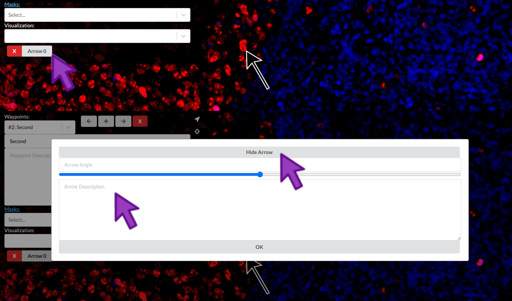
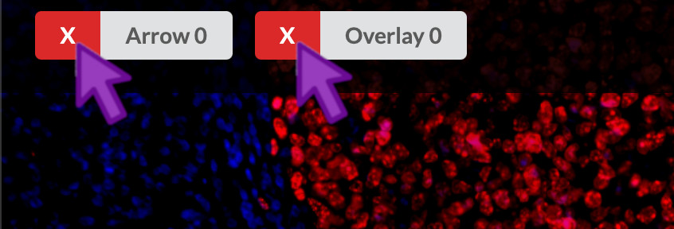

## **Curated** Stories guide a viewer through the data

* The precise purpose and expectations vary depending on the use case.
* The purposes can include a graphical abstract for a paper, a digital figure, 'eye candy' for a grant or press, or an educational description of the data.

## Story tab

You can open the rightmost tab to edit the waypoints of a story. In this tab, you can change the
active waypoint, which will activate the corresponding field of view, group of channels, and text
description.

{:style="max-width: 800px;"}

## Waypoints define the stops along a guided tour of your image

Waypoints are the defining feature that makes Minerva Stories so effective at communicating complexy
tissue biology and imaging data to a wide audience. They serve a similar purpose to audio narration
museum tours. When done well, they are like having the expert biologist or pathologist who collected
the data give you a personal tour of the image. Waypoints comprise a name, descriptive rich text, a
linked channel group, a particular location in the image and zoom level, and optional
region-of-interest annotations on the image.

## Add or remove waypoints

To add a waypoint, you can click the "+" icon. To remove a waypoint, you can click the "X" icon. To
assign a name to a waypoint, you can click the "Waypoint Name" field and begin typing the new
name. When writing waypoint names, think of them like short figure titles.

A new story starts with one empty waypoint. A story must have at least one waypoint so you
can't delete the last one, but if its name and descriptive text are empty then it will be hidden in
the published story.

{:style="max-width: 800px;"}

> ## Add waypoints
> Add two waypoints and give them the following names:
> 1. Structure of normal tonsil
> 2. B-cells and T-cells
{: .challenge}

## Activate a waypoint

You can click the waypoint dropdown menu to select a waypoint to view and edit. You can also click
either the left or the right arrow to navigate between waypoints.

{:style="max-width: 800px;"}

## Select field of view and channel group

To choose the image location and zoom level to link to the current waypoint, use the image pan and
zoom controls to move the image just where you want it. To select the appropriate channel
group that will be linked to the current waypoint, select if fom the Channel Groups dropdown.

> ## Set field of view and channel group
> Configure the field of view and channel group for the waypoints as follows:
> 1. Zoom in to focus on the central germinal center, but be sure to keep the crypt epithelium in
>    frame as well. Select the "Structural components" channel group.
> 2. Zoom in further to show the right side of the germinal center and its lower-right border, which
>    is rich in CD4-positive cells. Select the "Immune cells" channel group.
{: .challenge}

{:style="max-width: 800px;"}

## Compose waypoint text descriptions

Waypoints can have associated text descriptions, which can be thought of like a figure legend. They
should describe the biology you want to convey to the viewer in the context of the image framing and
channel group you have selected. You can write plain text, or you can use Markdown to add rich
styling.

If you write one of your channel names in the text, surround it with back-quote characters to have
Minerva Author automatically highlight them in the published story with their associated channel
color. This helps the viewer better understand the links between the text and image.

{:style="max-width: 800px;"}

> ## Enter waypoint descriptions
> Open content-04.txt. Copy the waypoint text provided there into waypoints 1 and 2.
{: .challenge}

## Add a region of interest

To bring attention to a specific region in an image, you can click the crosshairs icon on the right of the waypoints panel. Then, you can click and drag between two diagonal corners of the rectangular region of interest you would like to add.

{:style="max-width: 800px;"}

## Add an arrow

To annotate a specific point in an image, you can click the arrow icon on the right of the waypoints panel. Then, you can click the point in the image where you would like to add an arrow.

{:style="max-width: 800px;"}

## Describe the arrow

You can link a text description to your arrow in order to provide a more specific label within a field of view. At the bottom of the waypoint panel, click the label that corresponds to the arrow. Then you can add a description to the arrow. You can click "Hide Arrow" to display only the description, allowing a floating text annotation over the field of view without an accompanying arrow.

{:style="max-width: 800px;"}

### Delete arrows or regions of interest

At the bottom of the waypoint panel, you can click the "X" that corresponds to a given region of interest, arrow, or floating text annotation.

{:style="max-width: 800px;"}

### Preview

Now, you can preview your story to display exactly how the audience will view the waypoints.

{:style="max-width: 800px;"}


