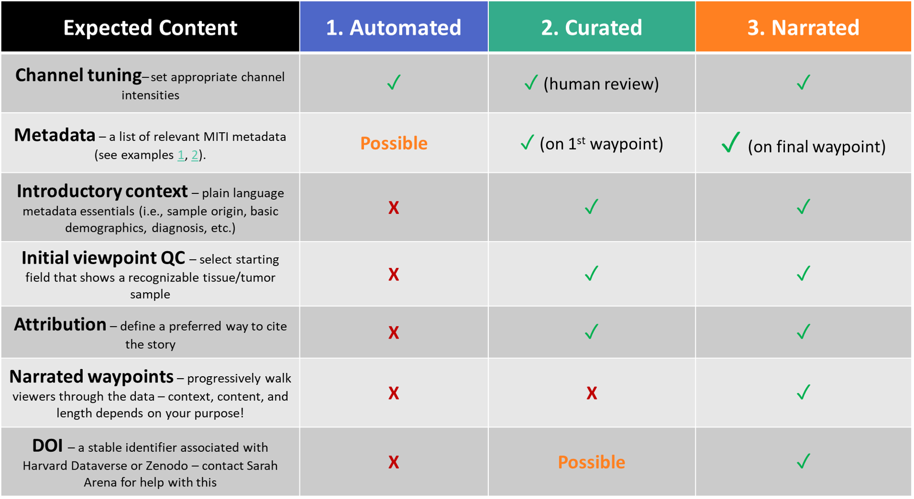

## Summary of the 3 styles

> ## Activity | What role can Minerva play in your data sharing?
> Think of a situation where you had to share your data with anyone, a collaborator, a colleague,
> a funding agency *etc.*. If you haven't encountered a scenario yet, come up with a hypothetical
> that is meaningful for your project.
> Try to answer the following questions with the knowledge of Minerva and story types you now have:
> 1. What your goals of sharing your tissue image data? Who are your audiences?
> 2. Which type of Minerva Story would you use? Why?
{: .callout}